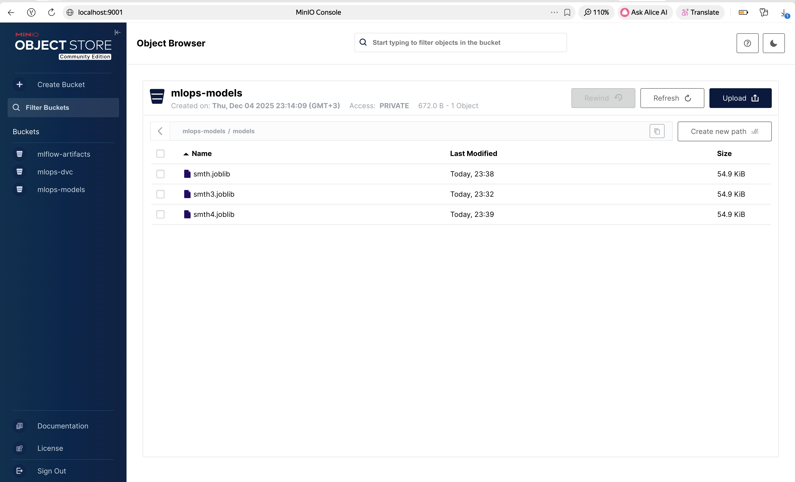
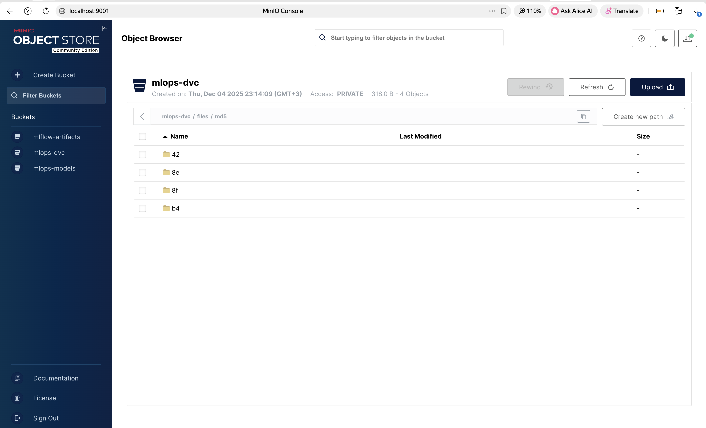
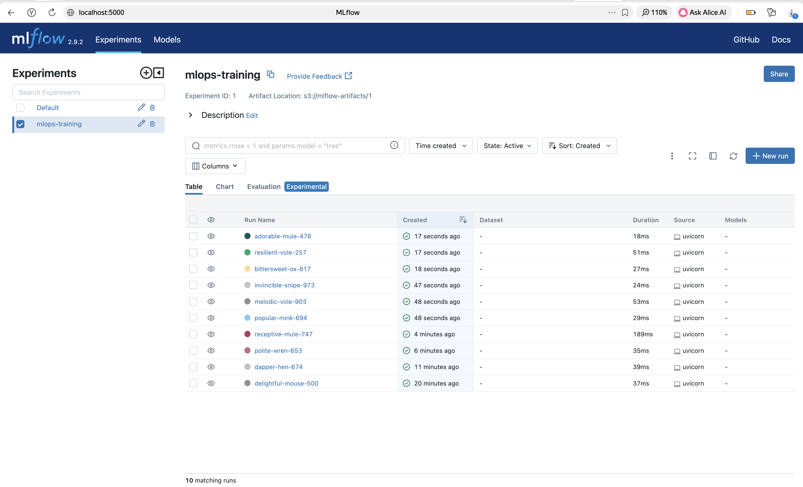

# HSE FTIAD MLOps HW 2
Выполнила: **Белоновская Кристина Константиновна**

## Структура проекта
```
├── app/
│   ├── main.py              # FastAPI приложение
│   ├── models/              # ML модели
│   │   ├── base.py          # Базовый класс
│   │   ├── implementations.py  # Linear/Logistic/RandomForest
│   │   └── registry.py      # Реестр моделей
│   ├── schemas/
│   │   └── api_schemas.py   # Pydantic схемы
│   ├── storage/
│   │   ├── model_storage.py # Хранилище моделей (локально + S3)
│   │   ├── s3_storage.py    # S3/Minio клиент
│   │   └── dataset_storage.py # DVC датасеты
│   ├── tracking/
│   │   └── mlflow_tracker.py # MLflow трекинг
│   └── utils/
│       └── logger.py        # Логирование
├── dashboard/
│   └── streamlit_app.py     # Streamlit дашборд
├── tests/
│   ├── test_api.py          # Тесты API
│   └── test_models.py       # Тесты моделей
├── .dvc/                    # DVC конфигурация
│   └── config               # Remote storage (Minio)
├── scripts/
│   └── init_minio.sh        # Инициализация Minio buckets
├── images/                  # Скриншоты для документации
├── Dockerfile               # Docker образ приложения
├── docker-compose.yml       # Оркестрация сервисов
├── pyproject.toml           # Poetry конфигурация
├── poetry.lock              # Зафиксированные зависимости
├── test_client.py           # Клиент для тестирования
└── README.md
```

## Запуск деплоя

```bash
docker-compose up --build
```
Запускет:
- **MLOps API** - основной сервис.
- **Minio** - s3 хранилище для моделей и dvc версионирования/хранения датасетов. Модели и Датасеты автоматически сохраняются в S3 при обучении и загружаются оттуда при необходимости. Датасеты обучения версионируются через DVC с remote storage в Minio.
- **MLflow** - для трекинга экспериментов. Отображаются метрики/метаданные запусков.
- **PostgreSQL** - хранилище данных для MLflow.

## Доступ к сервисам
- **API Swagger**: http://localhost:8000/docs
- **MLflow UI**: http://localhost:5000
- **Minio Console**: http://localhost:9001 (minioadmin/minioadmin)

## Тестирование работоспособности деплоя

```bash
python test_client.py
```

## Скриншоты сервисов








---
---
---
# HW 1

## Локальная установка

### Установка зависимостей

```bash
poetry install
poetry shell
```

### Запуск локально

**API сервер:**
```bash
uvicorn app.main:app --reload
```

**Streamlit дашборд:**
```bash
streamlit run dashboard/streamlit_app.py
```

**Настройка окружения:**
```bash
export USE_S3=false
export MLFLOW_ENABLED=false
```

* API: http://localhost:8000
* Swagger: http://localhost:8000/docs
* Dashboard: http://localhost:8501

## Доступные эндпоинты

### `GET /`
Корневой эндпоинт API.

### `GET /health`
Проверка статуса API.

### `GET /models/types`
Список доступных типов моделей с описанием гиперпараметров.

### `POST /models/train`
Обучение модели. Если модель с таким именем уже существует, она будет удалена и обучена заново.

**Запрос:**
```json
{
  "model_type": "logistic_regression",
  "model_name": "my_classifier",
  "hyperparameters": {"C": 1.0, "max_iter": 100},
  "X_train": [[1.0, 2.0], [3.0, 4.0], [5.0, 6.0]],
  "y_train": [0, 1, 0]
}
```

### `POST /models/predict`
Получение предсказаний от обученной модели.

**Запрос:**
```json
{
  "model_name": "my_classifier",
  "X": [[1.5, 2.5], [3.5, 4.5]]
}
```

### `GET /models`
Список всех обученных моделей.

### `GET /models/{model_name}`
Информация о конкретной модели (тип, гиперпараметры).

### `DELETE /models/{model_name}`
Удаление обученной модели.

## Доступные модели

### 1. Linear Regression
- **Описание**: Линейная регрессия для задач регрессии
- **Гиперпараметры**:
  - `fit_intercept` (bool): использовать ли beta_0 (по умолчанию: true)

### 2. Logistic Regression
- **Описание**: Логистическая регрессия для бинарной классификации
- **Гиперпараметры**:
  - `C` (float): обратная сила регуляризации (по умолчанию: 1.0)
  - `max_iter` (int): максимальное количество итераций оптимизации (по умолчанию: 100)

### 3. Random Forest
- **Описание**: Случайный лес для задач классификации
- **Гиперпараметры**:
  - `n_estimators` (int): количество деревьев (по умолчанию: 100)
  - `max_depth` (int): максимальная глубина деревьев (по умолчанию: None)
  - `random_state` (int): seed для воспроизводимости (по умолчанию: 42)


## Проверки

### Стиль кода
```bash
ruff check .
```

### Тесты
```bash
pytest tests/ -v
```
